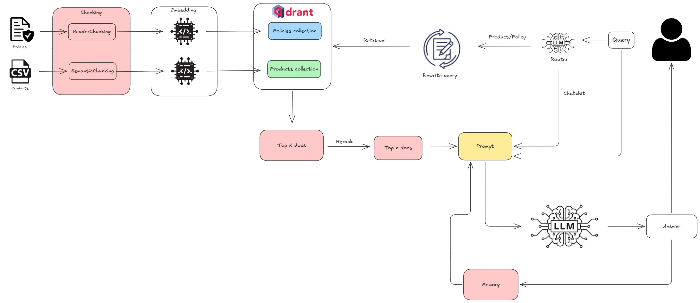
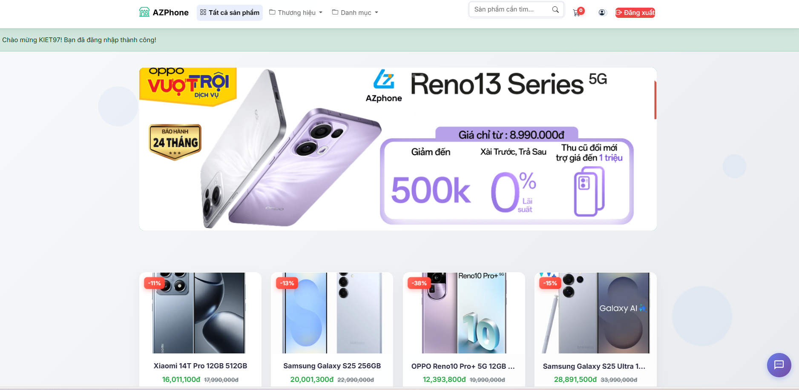
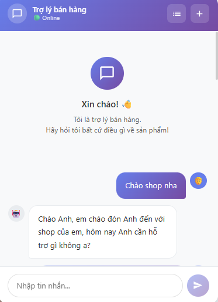
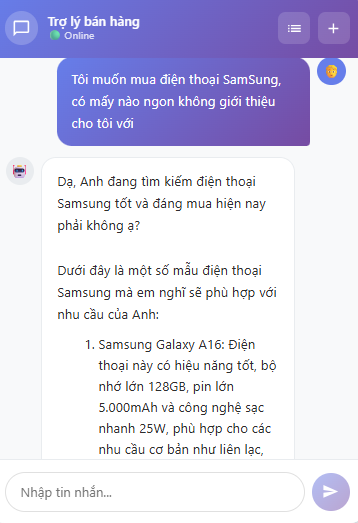
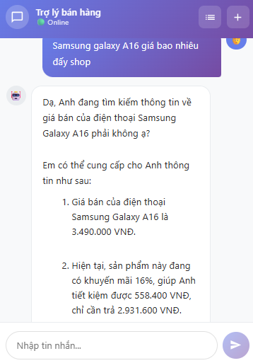

<!-- README (EN) -->

<div align="center">

# <u>WebSales with RAG Chatbot</u>
## <u>(Electronics sales management website integrated with a RAG chatbot for product & policy consulting)</u>

</div>

---

## 1) Overview
This project is an electronics sales management website that supports **product, order, customer, staff, warehouse, and accounting management**. The system aims to optimize sales workflows, manage inventory efficiently, and improve the overall customer experience for electronics stores.

In addition, the website integrates a **RAG-powered chatbot for product and store policy consulting** to improve service quality and customer support.

## 2) Key features
- **Consulting chatbot:** Uses a RAG system to answer questions about products and store policies.
- **Product management:** Add, edit, delete, and search electronics products with detailed information and images.
- **Order management:** Create, update, and track order status; view customers’ purchase history.
- **Customer management:** Store customer profiles and transaction history.
- **Warehouse management:** Track inventory, handle inbound/outbound operations, and alert when stock is low.
- **Accounting:** Revenue reporting.
- **User roles & permissions:** Admin, sales staff, warehouse staff, accounting staff, and customers.
- **Friendly UI:** Responsive design, easy to use on the web.
- **Notifications:** Order status updates, low-stock alerts, and system notifications.

## 3) Architecture
### 3.1) Website
- Website architecture/design documentation: see the `report/` folder in this repo.

### 3.2) RAG Chatbot
#### High-level diagram



#### Flow
1. The user submits a question.
2. The **Router** classifies the question as `policy`, `product`, or `chitchat`.
3. For **chitchat**: the system uses conversation history (**memory**) + a chitchat prompt and sends it to the **LLM**.
4. For **policy/product** questions:
   - **Rewrite** the query (spell correction and pronoun normalization suitable for policy/product).
   - Query **Qdrant** to retrieve `top-k` documents.
   - Use a **reranker** to select the most relevant `n` documents.
   - Combine `n` documents + query + memory into the prompt and send to the **LLM**.
5. The answer is saved into memory and chat history, then returned to the UI.

### 3.3) Evaluation
The RAG system was evaluated on a dataset of 43 samples with the following results:

| Metric | Score |
| :--- | :--- |
| **Faithfulness** | 80.23% |
| **Answer Relevancy** | 89.43% |

## 4) Tech stack
### 4.1) Website
- Backend: Python, Flask
- Frontend: HTML, CSS, Vanilla JavaScript
- Database: MySQL (SQLAlchemy)
- Template Engine: Jinja2
- Migrations: Alembic

### 4.2) Chatbot
- API: FastAPI
- LLM: Groq API Key
- Embeddings: `BAAI/bge-m3` (FlagEmbedding)
- Router model: `Qwen/Qwen1.5-1.8B-Chat` (transformers)
- Reranker: `BAAI/bge-reranker-v2-m3` (FlagEmbedding)
- Vector DB: Qdrant
- Memory: Redis
- Chat history: MongoDB

## 5) Project structure
```text
Flask-Ecommerce/
├── assets/
│   ├── chat1.png
│   ├── chat2.png
│   ├── chat3.png
│   ├── rag.png
│   └── web.png
├── chatbot/
│   ├── api_chatbot/
│   │   ├── deps.py
│   │   ├── main.py
│   │   ├── pipeline.py
│   │   └── schema.py
│   ├── prepare_database/
│   ├── history/
│   ├── router/
│   ├── reranking/
│   ├── prompt/
│   ├── pyproject.toml
│   └── uv.lock
├── migrations/
├── report/
├── shop/
│   ├── accounting/
│   ├── admin/
│   ├── carts/
│   ├── customers/
│   ├── products/
│   ├── sale/
│   ├── warehouse/
│   ├── static/
│   └── templates/
├── docker-compose.yml
├── main.py
├── web_requirements.txt
└── chatbot_requirements.txt
```

## 6) Installation & usage
### 6.1) Clone the repo
```bash
git clone https://github.com/KL0224/WebSale_Chatbot.git
```

### 6.2) Virtual environments (recommended: separate envs for web & chatbot)
- **Web**
  ```bash
  pip install -r web_requirements.txt
  ```

- **Chatbot** (uses `uv` — run inside the folder that contains `uv.lock`)
  ```bash
  uv sync
  ```

### 6.3) Databases
- Website DB: **MySQL** (install locally).
- RAG chatbot services: run `docker-compose.yml`
  ```bash
  docker compose up -d
  ```

### 6.4) Run
- **Web** (from the project root, activate the web environment)
  ```bash
  python main.py
  ```
  Open: http://localhost:5000

- **Chatbot** (run in `chatbot/`)
  ```bash
  uvicorn api_chatbot.main:app --host 0.0.0.0 --port 8000
  ```

## 7) UI screenshots
### 7.1) Website


### 7.2) Chatbot
<table>
  <tr>
    <td></td>
    <td></td>
    <td></td>
  </tr>
</table>

## 8) Contributing
Contact: **phamanhkiet97123@gmail.com**

## 9) License
MIT

---

